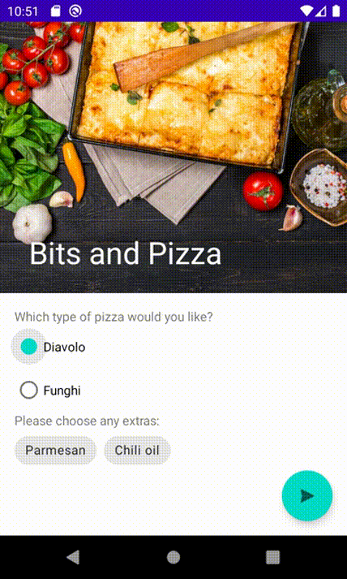

# Bits and Pizza 🍕

Material isn't just limited to toolbars, navigation drawers, and bottom navigation bars. It styles every view in app, from buttons to text views.

## App Structure

The app is comprised of an activity MainActivity that displays a fragment named Order Fragment. The fragment defines the Create Order screen's appearance and functionality.

## Components used

- Scrolling and collapsing toolbar
- Radio buttons, checkboxes and chips
- Floating Action Button (FAB)
- Snackbar

